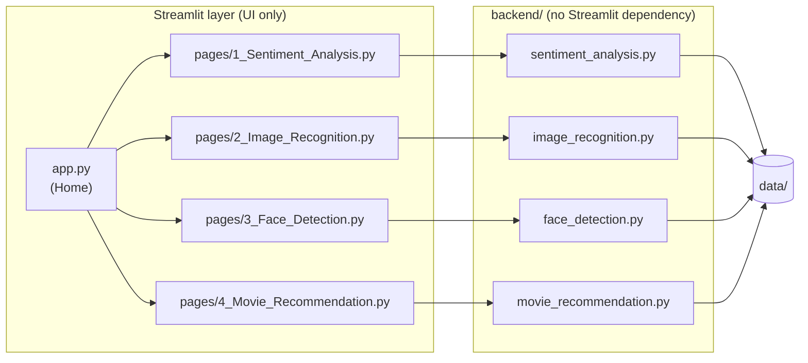

# 🤖 AI Playground — 4 Real-World AI Projects

[](https://www.python.org/)
[](https://streamlit.io/)
[](LICENSE)
[](https://github.com/<your-username>/<your-repo-name>/actions/workflows/tests.yml)

Four small, hands-on AI applications — one from each major branch of practical AI — packaged as a single tested, deployable Streamlit app.

**🚀 Live demo:** `https://<your-app-name>.streamlit.app` — replace this link once you've deployed (see [Deploying to Streamlit Community Cloud](#deploying-to-streamlit-community-cloud) below).

| # | Project | Field | Technique |
|---|---------|-------|-----------|
| 1 | 😊 **Sentiment Analysis** | Natural Language Processing | TF-IDF + Logistic Regression |
| 2 | 🖼️ **Image Recognition** | Computer Vision + Deep Learning | MobileNetV2 (transfer learning on ImageNet) |
| 3 | 👤 **Face Detection** | Computer Vision | OpenCV Haar Cascade |
| 4 | 🎬 **Movie Recommendation** | Recommendation Systems | TF-IDF + Cosine Similarity |

---

## Table of contents

- [How this project is organized](#how-this-project-is-organized)
- [Project structure](#project-structure)
- [Quickstart (run locally)](#quickstart-run-locally)
- [Running the tests](#running-the-tests)
- [Deploying to Streamlit Community Cloud](#deploying-to-streamlit-community-cloud)
- [Pushing this repo to GitHub](#pushing-this-repo-to-github)
- [The four projects, in detail](#the-four-projects-in-detail)
- [Design notes](#design-notes)
- [Credits](#credits)

---

## How this project is organized

This repo cleanly separates **the AI logic** from **the web UI**, so each half can be understood, tested, and reused on its own:



- **`backend/`** — the actual AI logic (data loading, training, prediction) as plain, importable Python classes. No UI code, no Streamlit import anywhere in this folder — it can be used from a script, a notebook, or a test suite just as easily as from the web app.
- **`pages/`** + **`app.py`** — the Streamlit UI, a thin layer that calls into `backend/` and renders the results. This is what gets deployed.
- **`notebooks/`** — the original exploratory notebook this project grew out of, kept for reference/provenance.
- **`tests/`** — a `pytest` suite covering the `backend/` modules.

## Project structure

```
ai-playground-4-projects/
├── app.py                              # Streamlit entry point (Home page)
├── ui_helpers.py                       # Shared, lightweight UI styling helpers
├── .github/
│   └── workflows/
│       └── tests.yml                   # CI: runs pytest on every push/PR
├── pages/
│   ├── 1_😊_Sentiment_Analysis.py
│   ├── 2_🖼️_Image_Recognition.py
│   ├── 3_👤_Face_Detection.py
│   └── 4_🎬_Movie_Recommendation.py
├── backend/
│   ├── __init__.py
│   ├── sentiment_analysis.py           # Project 1 core logic
│   ├── image_recognition.py            # Project 2 core logic
│   ├── face_detection.py               # Project 3 core logic
│   ├── movie_recommendation.py         # Project 4 core logic
│   └── sample_assets.py                # Shared fallback-image helper
├── data/
│   ├── sentiment_reviews.csv           # 232 labeled movie reviews
│   └── movies.csv                      # 12-movie catalog with descriptions
├── tests/
│   ├── conftest.py
│   ├── test_sentiment_analysis.py
│   ├── test_image_recognition.py
│   ├── test_face_detection.py
│   └── test_movie_recommendation.py
├── notebooks/
│   └── AI_Playground_4_Real_World_AI_Projects_v4.ipynb   # original notebook
├── .streamlit/
│   └── config.toml                     # theme + server settings
├── requirements.txt                    # Python dependencies (pip)
├── packages.txt                        # apt dependency (OpenCV safety net)
├── pyproject.toml                      # pytest config + project metadata
├── .gitignore
├── LICENSE
└── README.md
```

## Quickstart (run locally)

```bash
# 1. Clone your repo (after you've pushed it — see below) and enter it
git clone https://github.com/<your-username>/<your-repo-name>.git
cd <your-repo-name>

# 2. Create and activate a virtual environment
python3 -m venv .venv
source .venv/bin/activate        # Windows: .venv\Scripts\activate

# 3. Install dependencies
pip install -r requirements.txt

# 4. Run the app
streamlit run app.py
```

The app opens at `http://localhost:8501`. The Home page links to all four projects; they also appear in the sidebar.

> **First run of Project 2 (Image Recognition):** MobileNetV2's weights (~14 MB) download from the internet the first time the model is used, then stay cached for the rest of the session.

## Running the tests

```bash
pytest
```

This runs the full `backend/` test suite (sentiment analysis, movie recommendation, face detection, and image recognition). Tests for image recognition automatically **skip** — rather than fail — in any environment without TensorFlow installed, instead of breaking the whole suite.

A GitHub Actions workflow (`.github/workflows/tests.yml`) runs this same suite automatically on every push and pull request once this repo is on GitHub — no setup required.

## Deploying to Streamlit Community Cloud

1. Push this repo to GitHub (see the next section if you haven't yet).
2. Go to **[share.streamlit.io](https://share.streamlit.io)** and sign in with GitHub.
3. Click **"New app"**, then choose:
   - **Repository:** `<your-username>/<your-repo-name>`
   - **Branch:** `main`
   - **Main file path:** `app.py`
4. Open **"Advanced settings"** and set the **Python version** to **3.11** (this app supports 3.10–3.13; 3.11 is a safe, well-tested choice).
5. Click **Deploy**.

The first deploy takes a few minutes — it's installing TensorFlow and, the first time someone opens the Image Recognition page, downloading MobileNetV2's weights. Subsequent loads are much faster.

**If you see an OpenCV / `libGL.so.1` error:** this repo already includes the two standard fixes (`opencv-python-headless` in `requirements.txt`, and `libgl1` in `packages.txt`), so this shouldn't happen — but if it does, double check both files made it into your repo (they're easy to accidentally `.gitignore` or skip).

## Pushing this repo to GitHub

If this folder isn't a git repo yet:

```bash
cd ai-playground-4-projects
git init
git add .
git commit -m "Initial commit: AI Playground — 4 real-world AI projects"
git branch -M main
git remote add origin https://github.com/<your-username>/<your-repo-name>.git
git push -u origin main
```

(Create the empty repository on GitHub first via **New repository** — don't initialize it with a README there, to avoid a merge conflict with this one.)

## The four projects, in detail

### 1. 😊 Sentiment Analysis — NLP
`Raw Text → TF-IDF → Logistic Regression → Positive / Negative`
Trained on 232 hand-labeled movie reviews (116 positive, 116 negative). TF-IDF turns text into numeric vectors weighted by how distinctive each word is; Logistic Regression then learns the boundary between positive and negative patterns. The app shows live predictions with a confidence score, plus a full classification report and confusion matrix.

### 2. 🖼️ Image Recognition — Computer Vision + Deep Learning
`Image → Resize 224×224 → Preprocess → MobileNetV2 → Top-5 Classes`
Uses **transfer learning**: MobileNetV2, pretrained on 1.4M+ ImageNet images across 1,000 categories, classifies whatever photo you upload — no training required.

### 3. 👤 Face Detection — Computer Vision
`Image → Grayscale → Haar Cascade Scan → Bounding Boxes`
OpenCV's classic Haar Cascade detector locates faces by scanning for the contrast patterns typical of a face. Detection *(where is a face?)* is distinct from recognition *(whose face is it?)* — this project only does the former. Supports upload **or** a live webcam shot via `st.camera_input`, with adjustable `scaleFactor` / `minNeighbors` sliders.

### 4. 🎬 Movie Recommendation — Recommendation Systems
`Descriptions → TF-IDF → Cosine Similarity → Top-N Similar Movies`
A **content-based** recommender: every movie description becomes a TF-IDF vector, and cosine similarity ranks every other movie by how closely its description matches. No user ratings or watch history involved — a deliberately transparent contrast to collaborative filtering.

## Design notes

A few decisions worth knowing about if you're extending this project (or explaining it in an interview / submission writeup):

- **Backend has zero Streamlit imports.** Every `backend/` module works standalone (`python backend/sentiment_analysis.py` runs a small CLI demo) and is unit-tested independently of the UI.
- **TensorFlow is imported lazily**, inside the methods that need it rather than at the top of `image_recognition.py`. This keeps importing the module (and the rest of the app) fast, and means the other three backends can be tested in environments without TensorFlow installed at all.
- **Images are never written to disk.** Uploaded photos and the fallback sample images are handled entirely in memory (`PIL.Image` / `BytesIO`), which works cleanly on read-only or ephemeral deployment filesystems.
- **`opencv-python-headless`, not `opencv-python`.** The regular build pulls in a GUI backend (`libGL`) that headless Linux servers don't have — the single most common cause of OpenCV crashing on cloud deployments.
- **Face bounding boxes are drawn in RGB, not OpenCV's native BGR**, so the color tuple you pass is the color you actually get.
- **`st.camera_input()` replaces a Colab-specific JavaScript webcam hack** from the original notebook — Streamlit has a native equivalent, so no custom JS is needed.

## Credits

Built from an original teaching notebook (`notebooks/AI_Playground_4_Real_World_AI_Projects_v4.ipynb`) covering the same four projects, refactored here into a tested package with a deployable Streamlit front end.

## License

[MIT](LICENSE) — update the copyright name in `LICENSE` before publishing.
